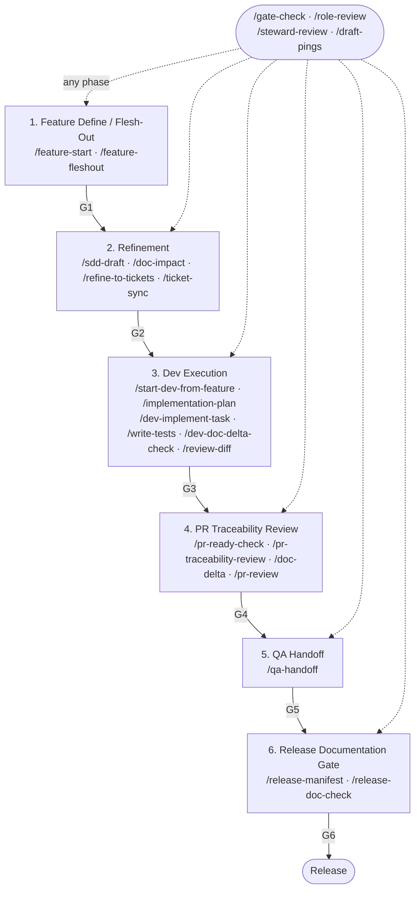
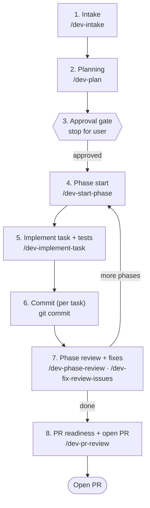
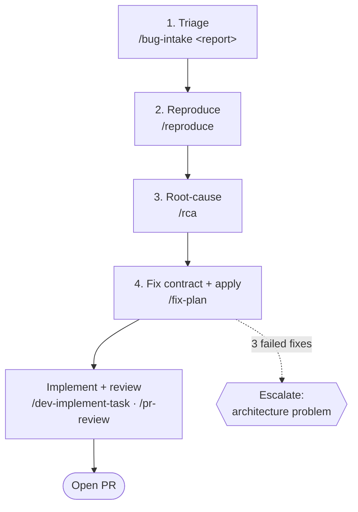

# Phase → Command Map

A quick reference for which commands each phase of a workflow uses. The toolbelt
has **three entry-point workflows** plus shared review/handoff utilities. Use
`/workflow-router` if you are unsure which command comes next.

## AI Feature Delivery (regulated / release-traceable)

Six gated phases, centered on the **Feature Master Record** — every artifact
derives from or links back to it. Full lifecycle and gate definitions:
`.atb/workflows/ai-feature-delivery-lifecycle.md`. Skill: `.atb/skills/ai-feature-delivery/`.

| # | Phase | Commands | Gate (must pass to advance) |
|---|-------|----------|------------------------------|
| 1 | **Feature Define / Flesh-Out** | `/feature-start`, `/feature-fleshout` | G1: target release, owner, impacted systems, doc changes, risks, reviewers identified |
| 2 | **Refinement** | `/sdd-draft`, `/doc-impact`, `/refine-to-tickets`, `/ticket-sync`, `/gate-check` | G2: each ticket traces to feature/release/master-record/SDD/requirement/AC/test/doc-delta |
| 3 | **Dev Execution** | `/start-dev-from-feature`, `/implementation-plan`, `/dev-implement-task`, `/write-tests`, `/dev-doc-delta-check`, `/review-diff` (`/webapp-test` for UI flows) | G3: impl summary, files changed, tests + results, SDD/SRS/SAD/CDP deltas, risks, reviewer checklist |
| 4 | **PR Traceability Review** | `/pr-ready-check`, `/pr-traceability-review`, `/doc-delta`, `/pr-review`, `/dev-fix-review-issues` | G4: PR maps to AC, tests present/waived, doc deltas done, risks logged, master record updated |
| 5 | **QA Handoff** | `/qa-handoff` | G5: AC, tests, regression areas, environments, risks, docs all linked |
| 6 | **Release Documentation Gate** | `/release-manifest`, `/release-doc-check` | G6: manifest lists included features, approved/withheld docs, exclusions; only `APPROVED_FOR_RELEASE` eligible |

**Cross-cutting (any time, not a phase):**

- `/gate-check` — generic check behind every gate (G1–G6).
- `/role-review` — role-specific gate review (QA / security / design).
- `/steward-review`, `/draft-pings` — daily status review and stakeholder pings.

The skill loads one reference per step
(`.atb/skills/ai-feature-delivery/SKILL.md`):

- `references/define-and-steward.md` → phase 1 + stewardship
- `references/design-refine-dev.md` → phases 2–3
- `references/gates-qa-release.md` → phases 4–6

## Dev Lite (lightweight / solo / fast)

Eight steps, no doc-control / QA / release gates. Workflow:
`.atb/workflows/dev-lite-feature-workflow.md`. Skill: `.atb/skills/dev-lite-workflow/`.

| # | Step | Command |
|---|------|---------|
| 1 | Intake (Feature Brief) | `/dev-intake` |
| 2 | Planning (phases + tasks) | `/dev-plan` |
| 3 | **Approval gate** (stop for user) | — |
| 4 | Phase start (confirm branch) | `/dev-start-phase` |
| 5 | Implement one task + tests | `/dev-implement-task` |
| 6 | Commit (per task) | *(git commit)* |
| 7 | Phase review + fixes | `/dev-phase-review`, `/dev-fix-review-issues` |
| 8 | PR readiness + open PR | `/dev-pr-review` |

## Bug-to-Fix (diagnostic / verification-first)

Four steps to a minimal fix, then the shared dev/review back half. Workflow:
`.atb/workflows/bug-to-fix-workflow.md`. Skill: `.atb/skills/bug-to-fix/`.

| # | Step | Command |
|---|------|---------|
| 1 | Triage (severity + intake) | `/bug-intake <report>` |
| 2 | Reproduce | `/reproduce` |
| 3 | Root-cause | `/rca` (`/rca --diagnose` for read-only) |
| 4 | Fix contract + apply | `/fix-plan` |
| → | Implement + review | `/dev-implement-task`, `/pr-review` |

State lives in a durable `bug-investigation.md`; use `/handoff` at any point.
Three failed fixes = treat as an architecture problem, not a fourth attempt.

## Shared utilities (any workflow)

- **Routing:** `/workflow-router` — identifies work type and routes to the next
  1–3 commands.
- **Request shaping:** `/shape-up` — interrogate a fuzzy request before planning.
- **Review:** `/pr-review` (tiered: light / standard / deep), `/pr-review-reply`,
  `/review-diff`.
- **Review triggers:** `/review-on-open` (event/poller), `/enqueue-review` +
  `/review-queue-worker` (push queue), `/phase-gate` (in-loop boundary review).
- **Tests:** `/cover`, `/cover-gaps`.
- **Cleanup:** `/simplify`, `/code-smell` (`--architecture` for no-code
  deepening candidates).
- **Release:** `/ship-it`.
- **Tickets:** `/ticket-sync`, `/to-issues`.
- **Durable state:** `/handoff`, and `/phase-create` → `/phase-start` →
  `/phase-close` / `/phase-status` for context-reset-safe phase state.
- **Retrofit:** `/retrofit` — apply one change across every site in a codebase.
